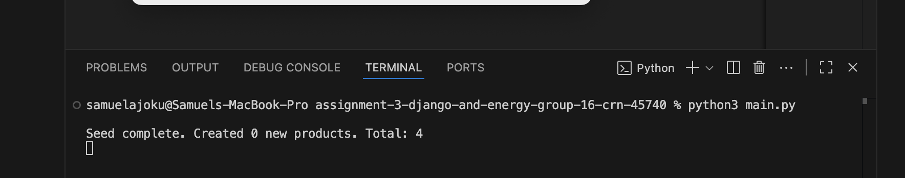
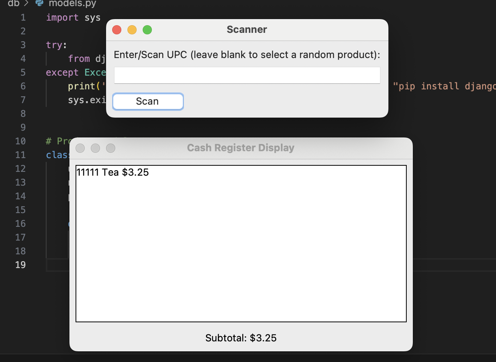
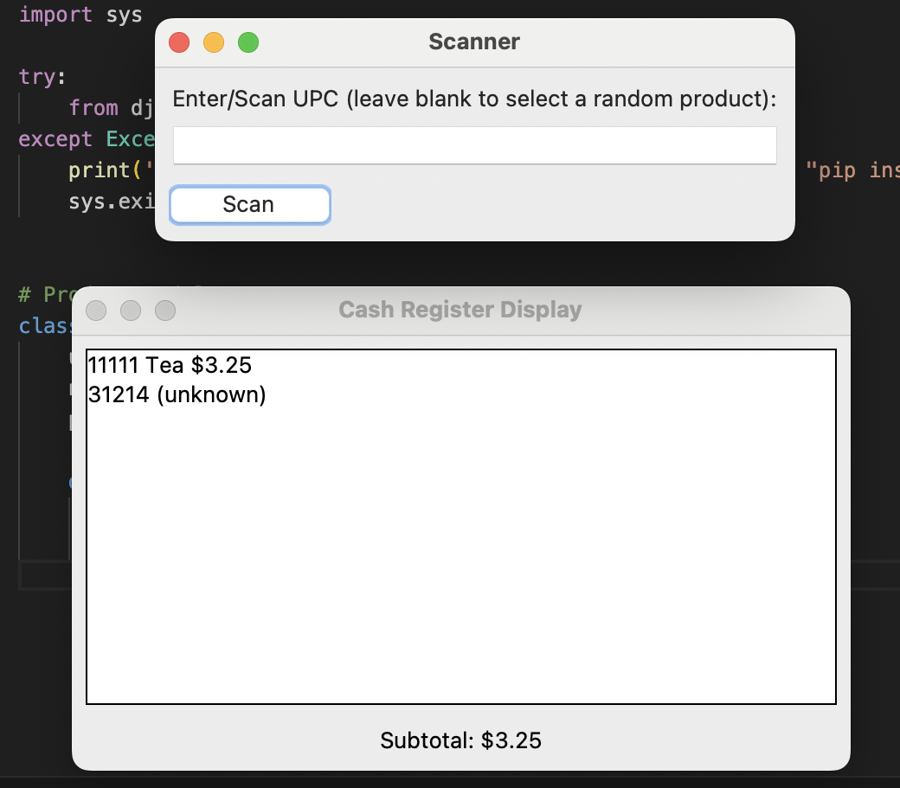
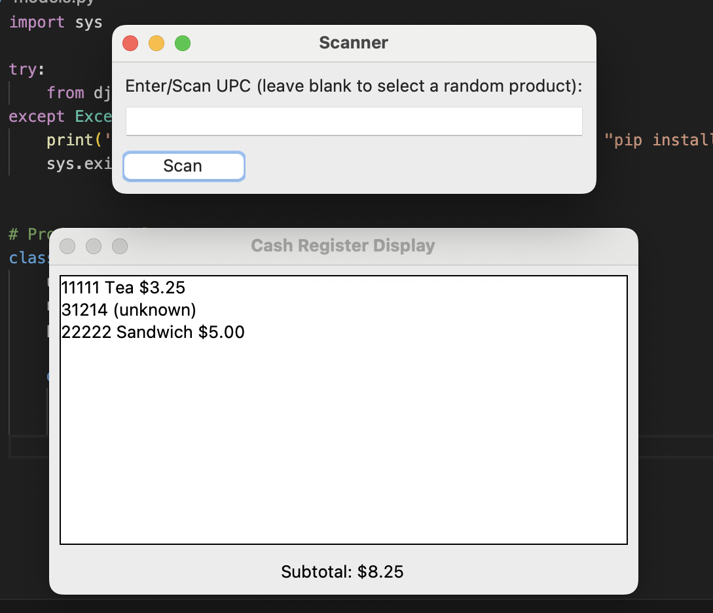

[)]
Assignment 3 – Cash Register using Django ORM
=====================

**Course:** <SOFE 3650>  
**Group:** Group 16 – CRN 45740  
**Author(s):** Samuel Ajoku , Omar Ahmed , Zeyad Ghazal 

This small, **standalone Python app** uses **Django ORM** (without a web server) to:
1) **Populate** an SQLite database with product **UPC, name, price**  
2) **Scan** a product via a GUI **input box** and **display** its name & price  
3) Maintain a running **Subtotal** (that matches follow the cash register requirements and follows a similar behavior as in Assignment 2)

:open_file_folder: Updated File Structure
---------------------------------
```
django-orm/
├── db/
│   ├── __init__.py
│   └── models.py
├── main.py
├── manage.py
├── README.md
├── settings.py
├── ScreenDumps/
│   ├── screen1.png
│   ├── screen2.png
│   ├── screen3.png
│   ├── screen4.png
│   └── screen5.png
└── products.txt
```

### Where we configured **Django ORM** using Django models
- **Model:** `db/models.py`
  ```python
  class Product(models.Model):
      upc = models.CharField(max_length=32, unique=True)
      name = models.CharField(max_length=120)
      price = models.DecimalField(max_digits=10, decimal_places=2)
  
- **Migrations:** created/applied via python3 manage.py makemigrations db and python3 manage.py migrate.
- **Querries:** in main.py

:rocket: How to Run after cloning repo locally (using macOS)
--------------------
# From repo root
python3 -m venv venv
venv/bin/activate
python3 -m pip install --upgrade pip
python3 -m pip install django

# To initialize DB schema
python3 manage.py makemigrations db
python3 manage.py migrate

# To run the app
python3 main.py

**NB:** "python 3 used because of python version


📸: Screen Dumps
----------------------

**1. DB populated (seed complete)**
    : Terminal output showing seed count and totals.
    


    
**2. Scan – known UPC (displays name & price)**
    : Scanner window after entering 11111 (or any UPC from products.txt).
    
    

    
**3. Scan – unknown UPC**
    : Enter a UPC not in DB; Display shows 31214 (unknown)
    


    
**4. Scan – without entering a UPC**
    : Click scan without typing a UPC; Generates a random UPC from DB
    
    

    
**5. Subtotal updates after multiple scans**
    : Display shows multiple lines and Subtotal updated.
    

    
📖: Design Notes
----------------------

Same behavior as Assignment 2 (Swing/MVC), now using Django ORM:

-Input box acts as a scanner (blank input triggers a random UPC).

-Display line format: UPC name $price.

-Unknown barcode: UPC (unknown).

-Running subtotal at the bottom.
